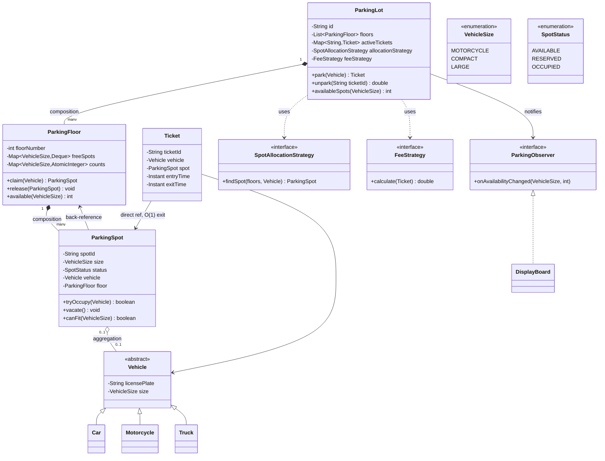

# LLD 01 — Parking Lot
*Pattern first · Java primary · Spring notes · concurrency at the end because that's where the interview is won*

Source problem: [`awesome-low-level-design/problems/parking-lot.md`](https://github.com/ashishps1/awesome-low-level-design/blob/main/problems/parking-lot.md)
Pattern catalogue referenced throughout: [`design-patterns`](https://github.com/ashishps1/awesome-low-level-design/tree/main/design-patterns)

---

## 1. The one idea

Strip the theming away and Parking Lot is a **resource allocation problem**:

> A pool of **heterogeneous** resources, a **matching rule** deciding which resource fits which claimant, and **concurrent claimants** who must each get exactly one.

Everything else — levels, tickets, fees, display boards — is dressing on those three nouns.

The design collapses into three questions, and an interviewer is grading you on all three:

| Question | The answer that scores | The answer that doesn't |
|---|---|---|
| **How do I find a fitting spot?** | index the free spots by `(floor, size)` so the answer is O(1) | scan every spot on every floor |
| **How do I decide *which* fitting spot?** | pull the policy out into a `SpotAllocationStrategy` | hard-code "first one I find" inside `park()` |
| **How do I stop two cars getting the same spot?** | atomic claim (CAS or a lock scoped to the free list, not the garage) | `synchronized` on the whole `ParkingLot` |

The interview trap here is **premature class-drawing**. Most candidates open with a UML dump. Open instead with the requirements table in §2, then the operation table in §3 — the classes fall out of those almost mechanically.

---

## 2. Requirements

### 2.1 Given (from the problem statement)

| # | Requirement | What it forces into the design |
|---|---|---|
| 1 | Multiple levels, each with N spots | a `ParkingFloor` layer — composition, not a flat list |
| 2 | Cars, motorcycles, trucks | a `Vehicle` type hierarchy + a `VehicleSize` enum |
| 3 | Each spot accommodates a specific type | `ParkingSpot` carries a `SpotSize`; a **fit rule** between spot and vehicle |
| 4 | Assign on entry, release on exit | a `Ticket` — the handle that makes release O(1) |
| 5 | Real-time availability | availability **counters**, not a scan; and a push mechanism (Observer) |
| 6 | Multiple entry/exit points, concurrent | the whole of §7. This is the requirement everyone under-designs. |

### 2.2 Clarifying questions to actually ask

Ask three or four of these — it is scored, and it changes your design:

1. **Fit rule:** strict (a car only fits a car spot) or **lenient** (a truck spot can hold a car)? Lenient forces a *fallback order* over sizes and changes `findSpot` from one lookup to a small ordered walk.
2. **Allocation policy:** first-available, nearest-to-entrance, or best-fit (smallest spot that fits)? Nearest-to-entrance changes the data structure from a deque to a priority queue.
3. **Pricing:** flat, hourly, tiered by size, free first 30 min? This is what justifies a Strategy.
4. **Reservations?** If yes, `ParkingSpot` needs a `RESERVED` state and a hold-expiry timer — that's a State machine, not a boolean.
5. **Scale:** one garage or a chain? One garage → Singleton is fine. A chain → Singleton is *wrong*, and saying so out loud is a differentiator.
6. **Payment:** in scope? If yes you get an Adapter for the gateway and a Strategy for methods.

### 2.3 Non-functional targets to state

| Property | Target | Why it matters here |
|---|---|---|
| `park` / `unpark` latency | O(1), sub-ms | a gate barrier can't wait on a garage-wide lock |
| Concurrency | correct under `E` entry gates in parallel | double-allocation is the defining bug |
| Consistency | no double-book, no lost spot on crash | claim and release must be atomic and idempotent |
| Availability display | eventually consistent is fine | a board a second stale is acceptable |

---

## 3. Core Operations & Complexity

`L` = floors, `S` = spots per floor, `T` = active tickets, `K` = number of size classes (3 here — small constant).

| Operation | Naive | Designed | Structure that gets you there |
|---|---|---|---|
| `findSpot(size)` | **O(L·S)** full scan | **O(1)** | `Map<VehicleSize, Deque<ParkingSpot>>` free list, per floor |
| `findSpot(size)`, lenient fit | O(L·S) | **O(K) = O(1)** | walk the size fallback order over the same maps |
| `findSpot`, nearest-to-entrance | O(L·S) then min | **O(log S)** | `PriorityQueue<Spot>` keyed by distance, per entrance |
| `park(vehicle)` | O(L·S) | **O(1)** amortised | poll free list + atomic state flip |
| `unpark(ticket)` | O(L·S) search for the vehicle | **O(1)** | `Map<ticketId, Ticket>`; the ticket **holds the spot reference** |
| `availableCount(size)` | O(S) recount | **O(1)** | `AtomicInteger` per `(floor, size)` |
| `isFull()` | O(L·S) | **O(1)** | sum of counters, or one global `AtomicInteger` |
| `calculateFee(ticket)` | O(1) | O(1) | duration × rate; the *policy* varies, not the cost |
| Notify display boards | O(D) observers | O(D) | Observer; D is small and bounded |
| **Memory** | — | **O(L·S + T)** | one object per spot, one per live ticket |

### The three structural decisions that produce that table

1. **Free lists instead of scanning.** Availability is *derived* state that you maintain incrementally, exactly like a running summary in a sliding window. You never recompute it. Park = `pop`, unpark = `push`.
2. **The ticket holds a direct reference to the spot.** This is the single highest-leverage decision in the whole design — it turns exit from a search into a dereference. If a candidate makes exit O(L·S), they haven't understood the problem.
3. **Counters are maintained, never computed.** `AtomicInteger` per bucket. Real-time availability (requirement 5) is then a read, not a sweep.

### Trade-off worth voicing

Free lists cost you O(L·S) extra memory and add an invariant to maintain (`spot.isFree ⟺ spot ∈ freeList`). If that invariant ever drifts you double-book. The mitigation is to make the free list the **single source of truth** — a spot's availability is defined by its membership, not by a separate boolean that can disagree with it. Saying this out loud shows you know derived state is a liability, not just a speedup.

---

## 4. The object model

### 4.1 Class diagram



### 4.2 Relationship types — say the right word

The repo has a whole [Class Relationships](https://github.com/ashishps1/awesome-low-level-design#-class-relationships) section because interviewers listen for these:

| Pair | Relationship | Why |
|---|---|---|
| `ParkingLot` → `ParkingFloor` | **Composition** (filled diamond) | a floor has no meaning outside its lot; destroy the lot, the floors die |
| `ParkingFloor` → `ParkingSpot` | **Composition** | same lifetime ownership |
| `ParkingSpot` → `Vehicle` | **Aggregation** (hollow diamond) | the car exists before and after parking; the spot merely references it |
| `Ticket` → `ParkingSpot` | **Association** | a navigable link, no ownership |
| `ParkingLot` → `FeeStrategy` | **Dependency** | injected, swappable, not owned conceptually |

Getting composition vs aggregation right on `Spot → Vehicle` is a small thing that lands well.

### 4.3 SOLID, mapped to concrete decisions here

| Principle | Where it shows up | The violation it prevents |
|---|---|---|
| **S**ingle Responsibility | `ParkingFloor` allocates; `FeeStrategy` prices; `Ticket` records. Not one god-class. | a `ParkingLot` that scans, prices, prints, and notifies |
| **O**pen/Closed | new pricing = new `FeeStrategy` impl, zero edits to `ParkingLot` | a growing `if (type == WEEKEND)` chain |
| **L**iskov | any `Vehicle` subtype works anywhere a `Vehicle` is expected | `Truck.getSize()` throwing, or subclasses that need special-casing |
| **I**nterface Segregation | `FeeStrategy` and `SpotAllocationStrategy` are separate one-method interfaces | one fat `ParkingPolicy` interface with 6 methods, half unimplemented |
| **D**ependency Inversion | `ParkingLot` depends on the *interfaces*, injected via constructor | `new HourlyFeeStrategy()` hard-coded inside `park()` |

**DIP is the one that pays off in Spring** — constructor-inject both strategies as beans and the whole thing becomes unit-testable with a stub. Which is also the argument against classic Singleton (§5.1).

---

## 5. Design patterns — which, where, and why

Full catalogue from [awesome-low-level-design/design-patterns](https://github.com/ashishps1/awesome-low-level-design/tree/main/design-patterns), graded against *this* problem. Don't recite the whole thing in an interview — name the four **Core** ones, then offer one or two extensions.

| Pattern | Verdict | Where it goes in Parking Lot |
|---|---|---|
| **CREATIONAL** | | |
| [Singleton](https://algomaster.io/learn/lld/singleton) | **✅ Core** | one `ParkingLot` instance — but see §5.1, there's a caveat worth stating |
| [Factory Method](https://algomaster.io/learn/lld/factory-method) | **✅ Core** | `VehicleFactory.create(type, plate)` — gate scanner reads a type code, not a class |
| [Builder](https://algomaster.io/learn/lld/builder) | **⭐ Strong** | `new ParkingLot.Builder().floor(1).spots(COMPACT, 50)...build()` — many optional config knobs |
| [Abstract Factory](https://algomaster.io/learn/lld/abstract-factory) | ❌ Not applicable | there is no *family* of related products varying together |
| [Prototype](https://algomaster.io/learn/lld/prototype) | ❌ Not applicable | nothing here is expensive to construct and worth cloning |
| **STRUCTURAL** | | |
| [Facade](https://algomaster.io/learn/lld/facade) | **⭐ Strong** | `ParkingLotService` — entry/exit terminals call one method, not floors + strategies + payments |
| [Adapter](https://algomaster.io/learn/lld/adapter) | **⭐ Strong** *(if payment in scope)* | wrap Stripe/Razorpay SDKs behind your own `PaymentProcessor` |
| [Composite](https://algomaster.io/learn/lld/composite) | ⚠️ Weak — don't force it | Lot→Floor→Spot *is* a tree, but you never treat a floor and a spot uniformly. Mention only if asked about nested zones/sections. |
| [Decorator](https://algomaster.io/learn/lld/decorator) | ⚠️ Situational | add-on charges: `EvChargingFee(ValetFee(BaseFee))`. Elegant, but a fee *list* is simpler. Say the trade-off. |
| [Flyweight](https://algomaster.io/learn/lld/flyweight) | ❌ Not applicable | spots have per-instance mutable state; nothing to share |
| [Proxy](https://algomaster.io/learn/lld/proxy) | ❌ Not applicable | no lazy-loading or access-control layer in scope |
| [Bridge](https://algomaster.io/learn/lld/bridge) | ❌ Not applicable | no two independent hierarchies varying orthogonally |
| **BEHAVIORAL** | | |
| [Strategy](https://algomaster.io/learn/lld/strategy) | **✅ Core — the highest-value pattern here** | **two of them:** `SpotAllocationStrategy` and `FeeStrategy` |
| [Observer](https://algomaster.io/learn/lld/observer) | **✅ Core** | display boards + entry-gate signage subscribe to availability changes (requirement 5) |
| [State](https://algomaster.io/learn/lld/state) | **⭐ Strong** | `ParkingSpot`: AVAILABLE → RESERVED → OCCUPIED → AVAILABLE. Legal transitions become code, not `if`s. |
| [Chain of Responsibility](https://algomaster.io/learn/lld/chain-of-responsibility) | ⚠️ Situational | payment fallback (wallet → card → cash), or floor-by-floor spot search |
| [Command](https://algomaster.io/learn/lld/command) | ⚠️ Situational | gate operations as objects → audit log, replay, undo a mis-scan |
| [Template Method](https://algomaster.io/learn/lld/template-method) | ⚠️ Situational | `AbstractFeeStrategy` fixing the skeleton (duration → rate → discount → tax). **Competes with Strategy — pick one, don't stack both.** |
| [Iterator](https://algomaster.io/learn/lld/iterator) | ❌ Not applicable | JDK collections already give you this |
| [Mediator](https://algomaster.io/learn/lld/mediator) | ❌ Not applicable | few components, no N×N coupling to untangle |
| [Memento](https://algomaster.io/learn/lld/memento) | ❌ Not applicable | no undo/snapshot requirement |
| [Visitor](https://algomaster.io/learn/lld/visitor) | ❌ Not applicable | the type hierarchy is stable and the operations are few |

### 5.1 Singleton — use it, then immediately qualify it

The problem statement calls for Singleton, so implement it. But the sentence that separates an L5 answer from an L4 one is:

> "I'll use Singleton because there's one physical garage. But classic `static getInstance()` is global mutable state — it makes unit tests order-dependent and it breaks the moment we manage a chain of garages. In a Spring service I'd get singleton scope from the container instead, which keeps the single instance but preserves constructor injection and testability."

Correct enum form (thread-safe, serialization-safe, reflection-safe — the JVM guarantees it):

```java
public enum ParkingLot {
    INSTANCE;
    private final List<ParkingFloor> floors = new ArrayList<>();
    // ...
}
```

If you write the double-checked-locking version, **the `volatile` is mandatory** — without it another thread can observe a partially-constructed object through instruction reordering:

```java
private static volatile ParkingLot instance;   // volatile is not optional

public static ParkingLot getInstance() {
    if (instance == null) {                    // no lock on the fast path
        synchronized (ParkingLot.class) {
            if (instance == null) {            // re-check under the lock
                instance = new ParkingLot();
            }
        }
    }
    return instance;
}
```

### 5.2 Strategy — the pattern that actually earns the offer

Two independent axes vary. Both belong behind interfaces.

**Axis 1 — which fitting spot do I pick?**

```java
public interface SpotAllocationStrategy {
    Optional<ParkingSpot> findSpot(List<ParkingFloor> floors, Vehicle vehicle);
}
```

Take the whole `Vehicle`, not just its `VehicleSize` — an EV-priority or handicapped-permit strategy needs attributes beyond size, and widening the parameter later is a breaking change to every implementation.

| Impl | Rule | Cost | When |
|---|---|---|---|
| `FirstAvailableStrategy` | lowest floor, first free spot | O(L) | default, dead simple |
| `NearestToEntranceStrategy` | min walking distance from the gate used | O(log S) with a PQ | premium garages |
| `BestFitStrategy` | smallest size that still fits | O(K) | maximises truck-spot availability |
| `EvPriorityStrategy` | EV → charging spots first, then fall back | O(K) | the classic follow-up |

**Axis 2 — what do I charge?**

```java
public interface FeeStrategy {
    double calculate(Ticket ticket);
}
```

`FlatRate` · `HourlyBySize` · `TieredHourly` (₹X first 2h, ₹Y after) · `WeekendSurge` · `FreeFirst30Min`.

**Why Strategy and not an `if`-chain:** pricing is the requirement most likely to change after launch. Strategy makes that a *new file*, not an edit to `ParkingLot` — Open/Closed, concretely. It also makes pricing unit-testable without constructing a garage.

Spring wiring, since that's your context:

```java
@Service
public class ParkingLotService {
    private final SpotAllocationStrategy allocation;
    private final FeeStrategy fee;

    // constructor injection — no `new`, no field @Autowired
    public ParkingLotService(SpotAllocationStrategy allocation, FeeStrategy fee) {
        this.allocation = allocation;
        this.fee = fee;
    }
}
```

With multiple impls, inject `Map<String, FeeStrategy>` (Spring keys it by bean name) and select at runtime — that's Strategy + a registry, and it's how you'd really ship it.

### 5.3 Observer — requirement 5, done properly

"Real-time information to customers" is a **push**, not a poll. Polling every board every second is O(D·L·S) of wasted work.

```java
public interface ParkingObserver {
    void onAvailabilityChanged(int floor, VehicleSize size, int available);
}
```

`ParkingFloor` fires on every claim and release; `DisplayBoard`, `EntranceSignage`, and a `MetricsCollector` subscribe.

**The two things to say:** (1) notify **outside** the lock, or a slow observer stalls the gate — copy the listener list, release the lock, then fire; (2) an observer that throws must not break the park operation — wrap each callback in a try/catch.

### 5.4 State — make illegal transitions unrepresentable

Once reservations exist, a boolean `isAvailable` is no longer enough:

```
AVAILABLE ──reserve()──> RESERVED ──occupy()──> OCCUPIED
    ▲                        │                      │
    └────── expire() ────────┘                      │
    └───────────────── vacate() ────────────────────┘
```

Encode legal transitions in the enum (or in state objects) so `occupy()` on an already-`OCCUPIED` spot throws instead of silently double-booking. This is the same instinct as the free-list-as-single-source-of-truth in §3: **don't let two representations of the same fact disagree.**

---

## 6. Templates

Java first (your Spring context), then the Python shape. This is skeleton code for an interview whiteboard, not production.

### 6.1 Enums and the fit rule

```java
public enum VehicleSize { MOTORCYCLE, COMPACT, LARGE }

public enum SpotStatus { AVAILABLE, RESERVED, OCCUPIED }

/** Lenient fit: a vehicle may take its own size or anything larger. */
public final class Fit {
    private static final List<VehicleSize> ORDER =
        List.of(VehicleSize.MOTORCYCLE, VehicleSize.COMPACT, VehicleSize.LARGE);

    /** Sizes acceptable for this vehicle, cheapest-fitting first. */
    public static List<VehicleSize> acceptable(VehicleSize v) {
        return ORDER.subList(ORDER.indexOf(v), ORDER.size());
    }
}
```

Ordinal ordering is doing real work here — declare the enum smallest-to-largest and the fallback order is free. Say that; it's the kind of detail interviewers notice.

### 6.2 Vehicle hierarchy + Factory Method

```java
public abstract class Vehicle {
    private final String licensePlate;
    private final VehicleSize size;

    protected Vehicle(String licensePlate, VehicleSize size) {
        this.licensePlate = licensePlate;
        this.size = size;
    }
    public String getLicensePlate() { return licensePlate; }
    public VehicleSize getSize()    { return size; }
}

public class Car        extends Vehicle { public Car(String p)        { super(p, VehicleSize.COMPACT); } }
public class Motorcycle extends Vehicle { public Motorcycle(String p) { super(p, VehicleSize.MOTORCYCLE); } }
public class Truck      extends Vehicle { public Truck(String p)      { super(p, VehicleSize.LARGE); } }

public class VehicleFactory {
    public static Vehicle create(String type, String plate) {
        return switch (type.toUpperCase()) {
            case "CAR"        -> new Car(plate);
            case "MOTORCYCLE" -> new Motorcycle(plate);
            case "TRUCK"      -> new Truck(plate);
            default -> throw new IllegalArgumentException("Unknown vehicle type: " + type);
        };
    }
}
```

**Why the factory earns its keep:** the entry terminal receives a *string* off a scanner. Without the factory that `switch` metastasises into every caller. With it, adding `ElectricCar` touches exactly one file.

### 6.3 ParkingSpot — the atomic claim

```java
public class ParkingSpot {
    private final String spotId;
    private final VehicleSize size;
    private final ParkingFloor floor;          // back-reference → O(1) release on exit
    private final AtomicReference<SpotStatus> status =
        new AtomicReference<>(SpotStatus.AVAILABLE);
    private volatile Vehicle vehicle;

    public ParkingSpot(String spotId, VehicleSize size, ParkingFloor floor) {
        this.spotId = spotId;
        this.size = size;
        this.floor = floor;
    }

    /** Returns true only for the single thread that wins the spot. */
    public boolean tryOccupy(Vehicle v) {
        if (!status.compareAndSet(SpotStatus.AVAILABLE, SpotStatus.OCCUPIED)) {
            return false;                 // someone else got here first
        }
        this.vehicle = v;
        return true;
    }

    public void vacate() {
        this.vehicle = null;
        status.set(SpotStatus.AVAILABLE);
    }

    public boolean canFit(VehicleSize v) { return size.ordinal() >= v.ordinal(); }
    public VehicleSize getSize()  { return size; }
    public String getSpotId()     { return spotId; }
    public ParkingFloor getFloor(){ return floor; }   // makes exit O(1), no floor search
}
```

`compareAndSet` is the whole concurrency story in one line: **exactly one** caller sees `true`. No lock, no contention on the fast path. `vehicle` is `volatile` so the winning write is visible to the thread that later reads it on exit.

The `floor` back-reference is what lets `unpark` release in O(1) instead of scanning floors to find the owner. (Purists will note that `ParkingFloor` passes `this` out of its own constructor — a mild escape. If it's raised, construct the spots in a separate `initialise()` call after the floor is fully built.)

### 6.4 ParkingFloor — free lists + counters

```java
public class ParkingFloor {
    private final int floorNumber;
    private final Map<VehicleSize, Deque<ParkingSpot>> free = new EnumMap<>(VehicleSize.class);
    private final Map<VehicleSize, AtomicInteger> counts   = new EnumMap<>(VehicleSize.class);
    private final List<ParkingObserver> observers = new CopyOnWriteArrayList<>();

    public ParkingFloor(int floorNumber, Map<VehicleSize, Integer> layout) {
        this.floorNumber = floorNumber;
        for (VehicleSize s : VehicleSize.values()) {
            free.put(s, new ConcurrentLinkedDeque<>());
            counts.put(s, new AtomicInteger(0));
        }
        layout.forEach((size, n) -> {
            for (int i = 0; i < n; i++) {
                free.get(size).push(
                    new ParkingSpot(floorNumber + "-" + size + "-" + i, size, this));
                counts.get(size).incrementAndGet();
            }
        });
    }

    /** O(K) ≈ O(1). Returns an already-claimed spot, or empty. */
    public Optional<ParkingSpot> claim(Vehicle v) {
        for (VehicleSize candidate : Fit.acceptable(v.getSize())) {
            Deque<ParkingSpot> pool = free.get(candidate);
            ParkingSpot spot;
            while ((spot = pool.poll()) != null) {      // poll is atomic
                if (spot.tryOccupy(v)) {                // CAS confirms the claim
                    int now = counts.get(candidate).decrementAndGet();
                    notifyObservers(candidate, now);
                    return Optional.of(spot);
                }
                // lost the CAS: spot was taken between poll and CAS — drop it and retry
            }
        }
        return Optional.empty();
    }

    public void release(ParkingSpot spot) {
        spot.vacate();
        free.get(spot.getSize()).push(spot);
        int now = counts.get(spot.getSize()).incrementAndGet();
        notifyObservers(spot.getSize(), now);
    }

    public int available(VehicleSize size) { return counts.get(size).get(); }

    public void subscribe(ParkingObserver o) { observers.add(o); }

    private void notifyObservers(VehicleSize size, int available) {
        for (ParkingObserver o : observers) {
            try { o.onAvailabilityChanged(floorNumber, size, available); }
            catch (RuntimeException ignored) { /* a bad board must not block a gate */ }
        }
    }
}
```

Three things to point at in this class:

- `ConcurrentLinkedDeque.poll()` **removes atomically** — two threads cannot receive the same spot from it. The subsequent CAS is belt-and-braces for the release path, and it's what makes the design safe even if a spot is somehow reachable twice.
- Counters are `AtomicInteger`, so `available()` is a lock-free O(1) read even while gates are parking.
- `CopyOnWriteArrayList` for observers: subscription is rare, iteration is hot, and it lets you notify without holding a lock.

### 6.5 ParkingLot — Facade + Singleton + injected strategies

```java
public class ParkingLot {
    private final List<ParkingFloor> floors;
    private final Map<String, Ticket> activeTickets = new ConcurrentHashMap<>();
    private final SpotAllocationStrategy allocation;
    private final FeeStrategy feeStrategy;

    public ParkingLot(List<ParkingFloor> floors,
                      SpotAllocationStrategy allocation,
                      FeeStrategy feeStrategy) {
        this.floors = List.copyOf(floors);
        this.allocation = allocation;
        this.feeStrategy = feeStrategy;
    }

    public Ticket park(Vehicle vehicle) {
        ParkingSpot spot = allocation.findSpot(floors, vehicle)
            .orElseThrow(() -> new NoSpotAvailableException(vehicle.getSize()));
        Ticket ticket = new Ticket(UUID.randomUUID().toString(), vehicle, spot, Instant.now());
        activeTickets.put(ticket.getId(), ticket);
        return ticket;
    }

    public double unpark(String ticketId) {
        Ticket ticket = activeTickets.remove(ticketId);   // remove() is the idempotency guard
        if (ticket == null) {
            throw new InvalidTicketException(ticketId);   // already exited, or never existed
        }
        ticket.setExitTime(Instant.now());
        ParkingSpot spot = ticket.getSpot();
        spot.getFloor().release(spot);                    // O(1) — no search anywhere
        return feeStrategy.calculate(ticket);
    }

    public int availableSpots(VehicleSize size) {
        return floors.stream().mapToInt(f -> f.available(size)).sum();
    }
}
```

**`activeTickets.remove()` returning the ticket is the idempotency guard** — a second exit scan for the same ticket gets `null` and is rejected rather than double-releasing the spot (which would corrupt the free list). Call that out; duplicate-exit is a real failure mode at a physical gate and most candidates miss it.

### 6.6 Python shape (for reading the repo's Python solution)

```python
from dataclasses import dataclass, field
from enum import IntEnum
from threading import Lock
from collections import deque
import uuid, time

class VehicleSize(IntEnum):          # IntEnum → ordering is free
    MOTORCYCLE = 0
    COMPACT    = 1
    LARGE      = 2

@dataclass
class ParkingSpot:
    spot_id: str
    size: VehicleSize
    vehicle: object | None = None

    def can_fit(self, v_size): return self.size >= v_size

class ParkingFloor:
    def __init__(self, number, layout: dict[VehicleSize, int]):
        self.number = number
        self._lock = Lock()                       # no CAS in CPython — use a lock
        self._free = {s: deque() for s in VehicleSize}
        for size, n in layout.items():
            for i in range(n):
                self._free[size].append(ParkingSpot(f"{number}-{size.name}-{i}", size))

    def claim(self, vehicle):
        with self._lock:                          # guards poll+assign as one unit
            for size in [s for s in VehicleSize if s >= vehicle.size]:
                if self._free[size]:
                    spot = self._free[size].popleft()
                    spot.vehicle = vehicle
                    return spot
        return None

    def release(self, spot):
        with self._lock:
            spot.vehicle = None
            self._free[spot.size].append(spot)
```

**Note the difference from Java:** Python has no `compareAndSet`, so the pop-and-assign must sit inside one `Lock`. The GIL does *not* save you — `if self._free[size]` followed by `popleft()` is two bytecode regions and a thread switch can land between them.

---

## 7. Concurrency — requirement 6, and where the interview is decided

### 7.1 The bug everyone writes

```java
// WRONG — check-then-act across two threads
ParkingSpot spot = findFreeSpot(size);   // thread A and B both see spot #42
spot.setVehicle(vehicle);                // both write; one car is silently unparked
```

The window between "found free" and "marked occupied" is the entire problem. Two gates, two cars, one spot.

### 7.2 The ladder of fixes — know all four, recommend the third

| Level | Approach | Correct? | Throughput | Verdict |
|---|---|---|---|---|
| 1 | `synchronized` on `ParkingLot.park()` | ✅ | **terrible** — the whole garage serialises on one monitor | what the reference solution does; correct but doesn't scale to `E` gates |
| 2 | Lock per `ParkingFloor` | ✅ | good — floors are independent | the easy win, one line of change |
| 3 | **Lock-free: `ConcurrentLinkedDeque.poll()` + `AtomicReference.compareAndSet()`** | ✅ | **best** — no blocking on the hot path | **recommend this** (§6.3–6.4) |
| 4 | Optimistic + retry loop on version stamps | ✅ | best, but hand-rolled | only if asked to go deeper |

**Why level 3 works, in one sentence:** `poll()` hands a given spot to exactly one caller, and `compareAndSet` lets exactly one caller flip `AVAILABLE → OCCUPIED`; a loser sees `false` and simply polls the next spot.

### 7.3 The four other concurrency points to raise

1. **Ticket ID generation.** `UUID.randomUUID()` is thread-safe and collision-free without coordination. A shared `int counter++` is a data race; `AtomicLong` fixes it but creates a single hot cache line across gates. UUID wins here.
2. **Notify outside the lock.** Holding a floor lock while calling `D` display-board callbacks makes the slowest board the garage's bottleneck. Snapshot the listeners, release, then fire.
3. **Idempotent exit.** `ConcurrentHashMap.remove()` returns non-null to exactly one caller — a re-scanned ticket is rejected rather than double-releasing (§6.5).
4. **Counter vs free-list drift.** The `AtomicInteger` and the deque are two separate atomics, so a reader can momentarily see a count that doesn't match the deque size. That is **acceptable** — availability display is explicitly allowed to be eventually consistent. What must *never* drift is the claim itself, and that's guarded by the CAS. Naming that distinction — strong consistency where it matters, eventual where it doesn't — is a strong L5 signal.

Relevant background from the repo's [concurrency section](https://github.com/ashishps1/awesome-low-level-design#-concurrency-and-multi-threading-concepts): [Race Conditions and Critical Sections](https://algomaster.io/learn/concurrency-interview/race-conditions-and-critical-sections), [Coarse vs Fine-grained Locking](https://algomaster.io/learn/concurrency-interview/coarse-vs-fine-grained-locking), [Compare-and-Swap](https://algomaster.io/learn/concurrency-interview/compare-and-swap).

---

## 8. Interview narration order

Don't draw classes first. This order, roughly 45 minutes:

| # | Minutes | Do | Say |
|---|---|---|---|
| 1 | 0–5 | Clarify | fit rule, allocation policy, pricing, reservations, single garage or chain (§2.2) |
| 2 | 5–8 | Restate scope | functional list + the non-functional table; explicitly park payments/reservations as extensions |
| 3 | 8–12 | **Core entities and enums** | `Vehicle`, `ParkingSpot`, `ParkingFloor`, `ParkingLot`, `Ticket`, `VehicleSize`, `SpotStatus` |
| 4 | 12–16 | **Operations + complexity** (§3) | free lists → O(1) park; ticket holds the spot → O(1) exit; counters → O(1) availability |
| 5 | 16–22 | Class diagram | draw it *after* the operations; call out composition vs aggregation |
| 6 | 22–30 | Name the patterns | Singleton (+ its caveat), Factory, **Strategy ×2**, Observer. Offer State/Builder/Facade as extensions. |
| 7 | 30–38 | Code the hot path | `claim()` and `park()`/`unpark()` only. Don't write getters. |
| 8 | 38–44 | **Concurrency** | the check-then-act bug, then the ladder, then recommend CAS + concurrent deque |
| 9 | 44–48 | Extensions | §9, pick whichever the interviewer leans toward |

**The two mistakes that sink otherwise-good candidates:** (a) drawing UML before establishing the operations, so the classes end up unmotivated; (b) leaving concurrency to the last two minutes when it's requirement #6 and the most interesting part.

---

## 9. Extension questions (have one sentence ready for each)

| Ask | One-line answer |
|---|---|
| **EV charging spots** | new `SpotFeature` set + an `EvPriorityStrategy`; falls back to normal spots when chargers are full |
| **Reservations** | `RESERVED` state + a hold with TTL; a scheduled sweeper expires stale holds back to `AVAILABLE` |
| **Dynamic / surge pricing** | new `FeeStrategy` reading current occupancy — zero changes to `ParkingLot`. This is Open/Closed paying off. |
| **Multiple garages** | drop Singleton; `ParkingLotRegistry` keyed by lot id. State the Singleton caveat here (§5.1). |
| **Lost ticket** | look up by license plate — needs a secondary `Map<plate, Ticket>` index; note the memory/consistency cost |
| **Crash recovery** | free lists are derived state — rebuild them on startup by scanning persisted spot statuses; O(L·S) once, at boot only |
| **Distributed / multi-node** | the CAS becomes a conditional write in the DB (optimistic locking on a version column), or a Redis `SETNX` lease per spot |
| **Handicapped/reserved spots** | a spot *feature* predicate rather than a new size — keeps `VehicleSize` from exploding combinatorially |

---

## 10. Recall card

```
ALLOCATION PROBLEM:  pool + matching rule + concurrent claimants
  find spot   → free list per (floor, size)     O(1)
  claim spot  → poll() + compareAndSet()        exactly one winner
  exit        → ticket HOLDS the spot ref       O(1), no search
  availability→ AtomicInteger per bucket        O(1) read
```

| Layer | Decision | The one-line justification |
|---|---|---|
| Data structure | free list per `(floor, size)` | turns O(L·S) scan into O(1) pop |
| Data structure | ticket → spot reference | turns exit from a search into a dereference |
| Pattern | **Strategy ×2** | allocation and pricing are the two things that change |
| Pattern | Singleton | one garage — but say why it's a liability at chain scale |
| Pattern | Factory Method | the gate reads a type string, not a class |
| Pattern | Observer | availability is a push, not a poll |
| Concurrency | CAS + concurrent deque | check-then-act is the bug; atomic claim is the fix |
| Consistency | strong on the claim, eventual on the display | know which one each requirement actually needs |

Five things to say cold:

1. It's a resource-allocation problem: pool, matching rule, concurrent claimants.
2. The ticket holds a reference to the spot — that's what makes exit O(1).
3. Strategy on **both** allocation and pricing, because those are the two axes that change.
4. `synchronized` on the whole lot is correct and useless; the claim is a CAS.
5. Singleton is right for one garage and wrong for a chain — and I'd take Spring's singleton scope over `static getInstance()` either way.

---

## 11. Repo coverage

Covered from [awesome-low-level-design](https://github.com/ashishps1/awesome-low-level-design):

- Problems → [Design Parking Lot](https://github.com/ashishps1/awesome-low-level-design/blob/main/problems/parking-lot.md) (all 6 requirements)
- Design Patterns → Singleton, Factory Method, Builder, Facade, Adapter, Strategy, Observer, State (used); the remaining 15 graded in §5
- Class Relationships → association, aggregation, composition, dependency (§4.2)
- Design Principles → SOLID mapped to concrete decisions (§4.3)
- Concurrency → race conditions, coarse vs fine-grained locking, compare-and-swap (§7)

Deferred to later LLD topics: Vending Machine and Elevator System (both State-machine-first, natural next problems after this one), ATM (State + Chain of Responsibility), LRU Cache (pure data structure), Splitwise (graph settlement).
